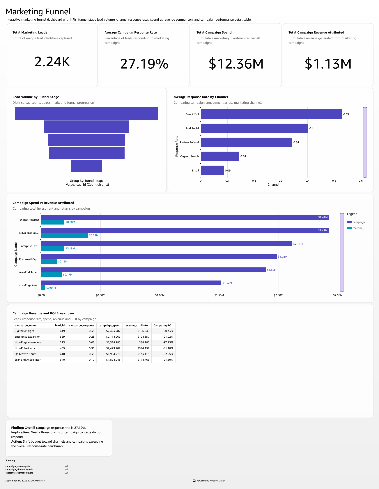
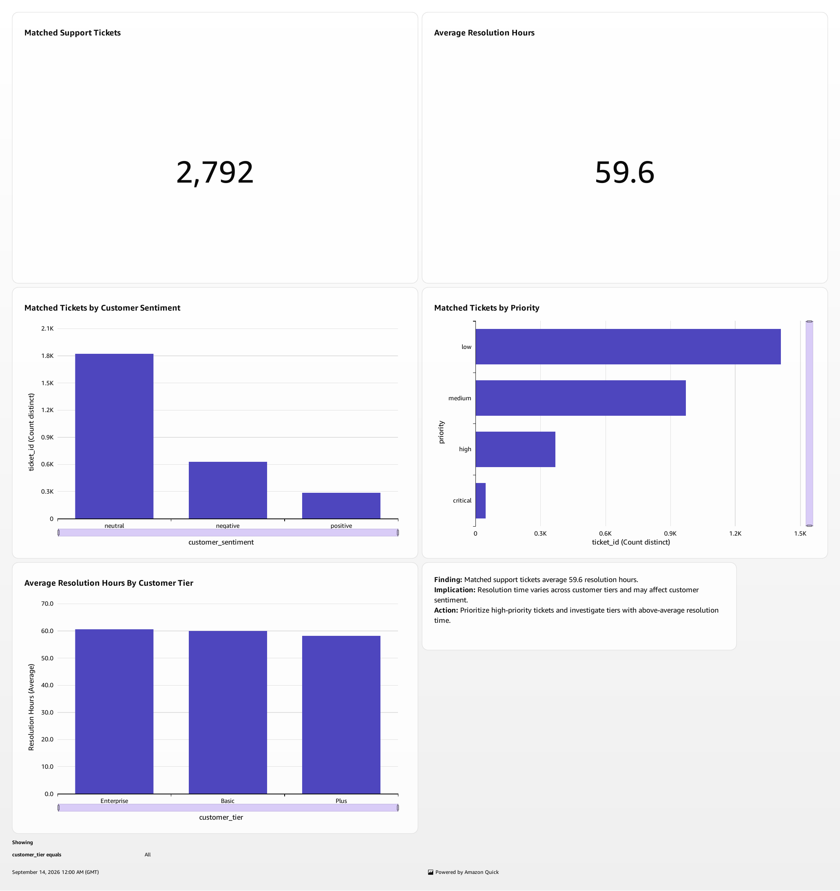

# NovaTech Revenue Intelligence Dashboard

## Cross-Functional Business Intelligence in Amazon Quick

This case study presents a three-sheet revenue-intelligence solution integrating marketing, sales, and customer-support data. The dashboard was designed to help leadership evaluate funnel efficiency, pipeline performance, and customer health while maintaining strict controls around join fan-out and metric interpretation.

## Business problem

NovaTech needed a consolidated analytical view across disconnected CRM, marketing, and support datasets. The core challenge was not merely visualizing the data; it was preserving authoritative business totals while enabling valid cross-domain analysis.

## Data model

| Source | Source rows | Prepared columns | Business calculation |
|---|---:|---:|---|
| CRM deals | 499 | 21 | Days to Close |
| Marketing campaigns | 2,240 | 21 | Campaign ROI |
| Support tickets | 3,000 | 21 | Resolution Hours |
| Unified dataset | 63,420 | 63 | Source calculations retained |

CRM was used as the anchor, with Marketing and Support left-joined on `account_id`. Multiple records per account produced many-to-many fan-out. Consequently, source datasets remained authoritative for additive totals, while the unified dataset was limited to matched-account relationships and distinct-identifier analysis.

## Dashboard design

### Marketing Funnel

- Lead volume and response rate
- Campaign spend and attributed revenue
- Channel and campaign comparisons
- Campaign ROI analysis

### Sales Pipeline

- Deal value and opportunity volume
- Won-versus-lost outcomes
- Regional performance
- Sales-cycle duration and monthly close trends

### Customer Health

- Ticket volume and resolution time
- Sentiment and priority distribution
- Customer-tier comparisons
- Navigation from regional sales analysis

## Key findings

- Marketing efficiency required validation: attributed revenue was materially below recorded spend across all six campaigns. Attribution logic and spend allocation should be validated before budgets are increased.
- Sales outcomes were comparatively strong: the CRM source contained 315 Won and 184 Lost opportunities, a 63.1% win rate.
- Regional process performance differed: the West averaged 70.09 days to close versus 62.87 days in the East, indicating a process-review opportunity rather than proof of a causal regional disadvantage.
- Critical Enterprise support tickets averaged materially longer resolution time than Basic tickets, supporting deeper root-cause analysis of complexity, escalation paths, and staffing.

## Analytical controls

- Validated source data before import
- Loaded three source datasets into SPICE
- Reviewed field types and calculated fields
- Used distinct identifiers for joined relationship analysis
- Documented many-to-many join limitations
- Avoided causal claims unsupported by the observational data
- Enriched the natural-language Topic with descriptions, synonyms, filters, and outcome definitions

## Deliverables

- [Three-sheet dashboard](NovaTech_Revenue_Intelligence_Dashboard.pdf)
- [Project report](NovaTech_Revenue_Intelligence_Project_Report.pdf)
- Dashboard previews included in the repository

## Tools and methods

Amazon Quick, SPICE, calculated fields, dataset joins, dashboard design, interactive filters, navigation actions, natural-language BI Topic configuration, metric validation

## Skills demonstrated

Business intelligence · Data modeling · Dashboard design · KPI development · Data validation · Analytical governance · Executive reporting

## Attribution

Completed by **Yayson Valencia** as part of the Udacity Future AWS Agentic AI Business Professional program. The author prepared and validated the datasets, designed the analytical model and dashboards, configured calculations and interactions, tested the natural-language experience, interpreted the findings, and documented methodological limitations.

## Data note

Course-provided raw datasets and private environment links are not redistributed. The repository contains only the finished analytical artifacts and selected visual evidence.
